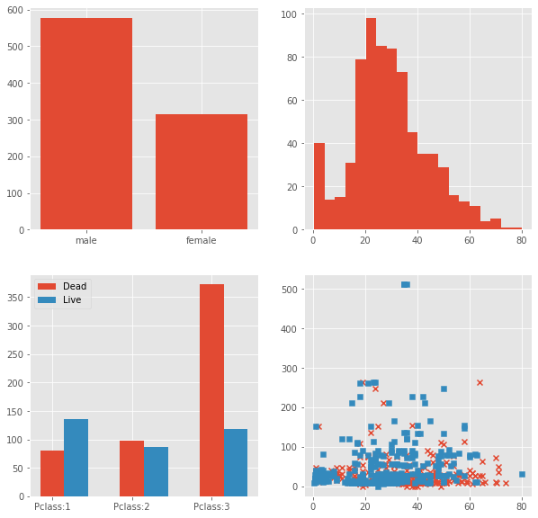
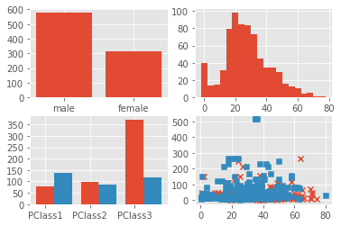

# Example
* Must be the same.

1. 男女性別人數
2. 年齡區間(0-80歲區分20塊)
3. 艙等有三個，長條圖個別的罹難人數和活著人數
4. 散佈圖，藍色方形是存活，紅色叉罹難，橫軸是年齡，縱軸是花多少錢買這船票花多少錢。
5. 預設的藍紅色就可以了。

## Use the data

1. Survived
2. Pclass 船艙等級
3. Sex
4. Age
5. Fare 船票價格

# Result

## Figure

## Important program logic

### 計算各個年齡區間有多少人
* 原先打算要一一比對，也就是該人符合哪個區間，且該區間人數加一。可是這樣判斷要寫非常多，用迴圈更會增加運算時間。
* 修正：用除法。先找出每個間隔多少，在用除法找出商數。接著在商數位置的區間加一，避免程式執行過長。
* 注意：本題區間有概括最大值，判斷上須注意商數為0的值。~~判斷流程如下：~~

~~1. 商數為0不判斷餘數值。不然減一後被歸類在80歲。~~
~~2. 判斷餘數為零，則被歸類的區間值必須減一。~~
~~3. 餘數不為零，則不做變動。~~
>> 突然發現最小值不是0，所以不用擔心商數為0時判斷餘數值的問題。

### Clean Code
* 將程式碼三大塊合併，降低運算時間。
* 後續才要開始繪圖。
* 架構都已經想好才開始做，不然做到一半出問題就尷尬了。

### Pclass算法修正
* 原先算法是直接透過船艙編號，再存入是否存活。
* 修正：以存活為準，再透過船艙編號存入。主要是為了畫圖。值得發現的邏輯，以後要畫兩者比較圖，先要判斷要比較的項目，再依據個別單位儲存。

